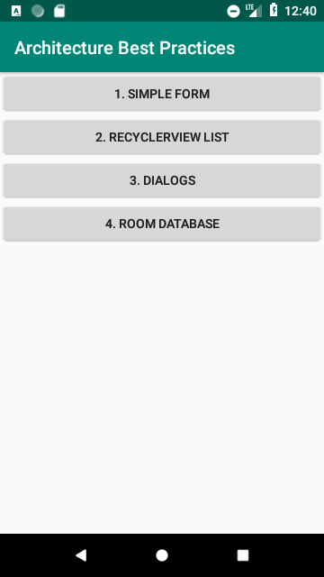
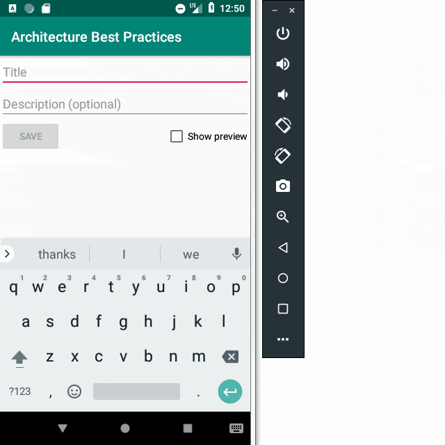
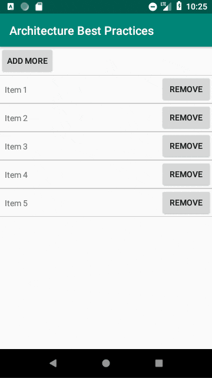
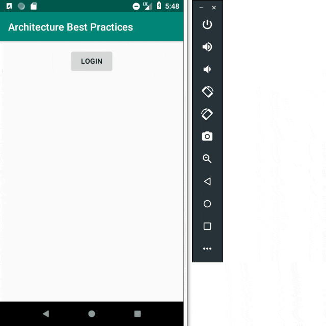
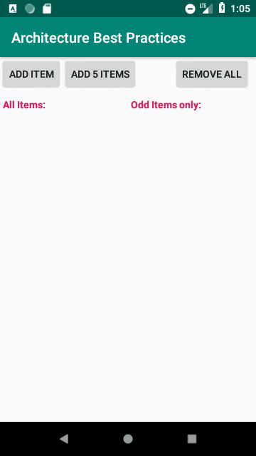

# Android Architecture with Kotlin – Best Practices

**This sample project provides several examples of using modern architecture approaches.**

For instance, it uses:

* MVVM architectural pattern
* Architecture Components:
  * LiveData
  * ViewModel
  * Room
* Data Binding

In addition, some examples use:

* ConstraintLayout
* RecyclerView
	* ViewHolder
	* DiffUtil

The project consists of several parts. I tried to make them as simple as possible,
so each of them focuses on a particular functionality and nothing more.

Therefore you can easily appeal to a certain part
to figure out how to implement similar functionality in your own app.

## Credits

Before you get into the examples, I recommend to read/watch the following awesome tutorials.
I sorted them in the order I think is the best for learning.

So go ahead!

### Data Binding:

* [Lisa Wray — Data Binding in a Kotlin world][TW9dSEgJIa8]
* [Data Binding Library][data-binding]

### ViewModel & LiveData:

* [Android Jetpack: ViewModel][5qlIPTDE274]
* [Android Jetpack: LiveData][OMcDk2_4LSk]
* [LiveData Clean Code using MVVM and Android Architecture Components][53468ed0dc1f]
* [LiveData with SnackBar, Navigation and other events (the SingleLiveEvent case)][ac2622673150]
* [Android Architecture: Communication between ViewModel and View][ce14805d72bf]

### Room:

* [Android Jetpack: Room][SKWh4ckvFPM]
* [Android Room with a View - Kotlin][room-with-a-view-kotlin]
* [Android Persistence codelab][persistence]

## Examples

Now you're ready to explore the examples of this project.

### 1. Simple Form

This part demonstrates how to create a regular user input form in a reactive way.

It actively uses Data Binding, Two-Way Data Binding and binding expressions.
The state of the form is perfectly persistent across configuration changes, thanks to ViewModel.
It also utilizes Google's SingleLiveEvent to display a Toast after the form is submitted.

### 2. RecyclerView List

Here we create a reactive and efficient list of items.

It uses RecyclerView, Adapter and ViewHolder in conjustion with ViewModel and LiveData.

### 3. Dialogs

Example of a robust login dialog with a custom layout
that perfectly preserves its state during configuration changes.

It also performs a slight validation of input data.

### 4. Room Database

This part demonstrates the basic usage of the Room database framework.

Both lists within the Activity are being updated immediately and reactively.
Even the list that requests odd items only through the `WHERE` condition.

Working with SQLite database has never been so pretty!

## License

This software is released under the MIT License.
See [LICENSE.txt](LICENSE.txt) for details.

[TW9dSEgJIa8]: https://www.youtube.com/watch?v=TW9dSEgJIa8
[data-binding]: https://developer.android.com/topic/libraries/data-binding/

[5qlIPTDE274]: https://www.youtube.com/watch?v=5qlIPTDE274
[OMcDk2_4LSk]: https://www.youtube.com/watch?v=OMcDk2_4LSk
[53468ed0dc1f]: https://android.jlelse.eu/lets-keep-activity-dumb-using-livedata-53468ed0dc1f
[ac2622673150]: https://medium.com/androiddevelopers/livedata-with-snackbar-navigation-and-other-events-the-singleliveevent-case-ac2622673150
[ce14805d72bf]: https://android.jlelse.eu/android-architecture-communication-between-viewmodel-and-view-ce14805d72bf

[SKWh4ckvFPM]: https://www.youtube.com/watch?v=SKWh4ckvFPM
[room-with-a-view-kotlin]: https://codelabs.developers.google.com/codelabs/android-room-with-a-view-kotlin/
[persistence]: https://codelabs.developers.google.com/codelabs/android-persistence/
